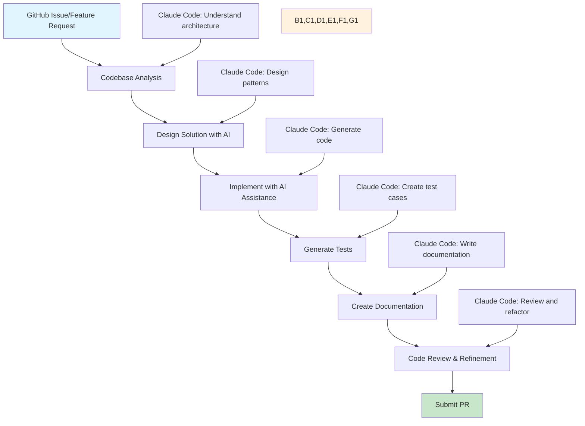

# DDEV Development with Claude Code
## Training Presentation


**AI-Assisted Development Workflows**

---

**Presented by:** Randy Fay, DDEV Maintainer  
**Date:** August 21, 2025  
**Time:** 10:00 US ET / 16:00 CEST  
**Duration:** 60-90 minutes with Q&A

<div class="ddev-highlight">
🎯 <strong>Goal:</strong> Learn practical techniques for using Claude Code to enhance DDEV development workflows
</div>

Note: [TIMING: 2 minutes] Welcome everyone to this comprehensive training session on DDEV development with Claude Code. Today we'll explore how AI can enhance your development workflow with practical examples and live demonstrations.

---

## About Your Presenter

**Randy Fay** - DDEV Maintainer & Lead Developer

**Background & Experience:**
- **DDEV Project Lead:** Primary maintainer and architect of DDEV since 2016
- **Docker Development Expert:** 8+ years developing containerized development environments
- **Open Source Contributor:** Active contributor to PHP, Go, and DevOps ecosystems
- **Developer Advocate:** Regular speaker at conferences and meetups worldwide
- **Technical Writer:** Author of DDEV documentation and numerous technical tutorials

**DDEV Expertise:**
- Led DDEV through major architectural transitions and feature developments
- Built DDEV's Docker-based local development environment from the ground up
- Extensive experience with cross-platform development challenges
- Deep knowledge of PHP, Go, Docker, and containerization technologies

**AI Development Integration:**
- Early adopter of AI-assisted development tools in open source projects
- Practical experience using Claude Code for DDEV feature development and bug fixes
- Advocate for responsible AI integration in software development workflows

<div class="ddev-highlight">
💡 <strong>Today's Perspective:</strong> Practical, real-world experience using AI tools to solve actual DDEV development challenges
</div>

Note: [TIMING: 3 minutes] Randy brings both deep technical expertise with DDEV and practical experience using AI development tools in production environments.

DELIVERY TIPS:
- Briefly introduce yourself and establish credentials with DDEV
- Mention your practical experience with Claude Code on real DDEV issues
- Ask audience about their experience level with DDEV/AI tools
- Set expectations for interactive format with live demonstrations
- Test screen sharing and audio
- Remind audience to use chat for questions

---

## Table of Contents

<div class="toc-grid">
  <a href="#/introduction" class="toc-link">
    <strong>1. Introduction & Overview</strong><br>
    <small>Training goals, DDEV & Claude Code intro</small>
  </a>
  
  <a href="#/setup" class="toc-link">
    <strong>2. Setup & Configuration</strong><br>
    <small>Installation, API config, DDEV setup</small>
  </a>
  
  <a href="#/workflows" class="toc-link">
    <strong>3. Technical Workflows</strong><br>
    <small>Navigation, Go patterns, testing</small>
  </a>
  
  <a href="#/demos" class="toc-link">
    <strong>4. Live Demonstrations</strong><br>
    <small>Real GitHub issues & solutions</small>
  </a>
  
  <a href="#/best-practices" class="toc-link">
    <strong>5. Best Practices</strong><br>
    <small>Code quality, testing, collaboration</small>
  </a>
  
  <a href="#/qa" class="toc-link">
    <strong>6. Q&A & Resources</strong><br>
    <small>Discussion, takeaways, follow-up</small>
  </a>
</div>

**Navigation Tips:** Use arrow keys, 'o' for overview, 's' for speaker notes

**Presenter Notes Available:** Press 's' to open speaker view with detailed timing and delivery guidance

Note: [TIMING: 1 minute] This presentation covers approximately 60-90 minutes of content with interactive Q&A throughout. Each section builds on the previous one, starting with fundamentals and moving to practical application.

DELIVERY TIPS:
- Emphasize the interactive nature
- Let people know they can ask questions anytime
- Point out the navigation controls for those following along
- Mention that materials will be shared afterward

---

<!-- Introduction Section -->
<section id="introduction">

<a href="#/1" class="back-to-toc">← TOC</a>
<div class="section-breadcrumb">Section 1 of 6</div>

# Introduction & Overview

Note: Section 1 of 6 - Setting the context for AI-assisted DDEV development

--

## What You'll Learn Today

**Practical AI-Assisted Development Techniques:**

* **Practical workflows** for DDEV development with Claude Code
* **Real-time implementation** of DDEV features and bug fixes
* **Best practices** for AI-assisted development in open source projects
* **Techniques applicable** to your own development projects

**Training Format:**
- **Duration:** 60-90 minutes with Q&A
- **Style:** Live demonstrations + interactive discussion  
- **Focus:** Real GitHub issues and practical solutions
- **Approach:** Learning by doing, not just theory

<div class="ddev-highlight">
🎯 <strong>Key Outcome:</strong> You'll leave with concrete techniques you can immediately apply to your own development workflow
</div>

Note: [TIMING: 4 minutes] This is a hands-on training focused on practical application rather than theory. We'll be working with real GitHub issues and demonstrating actual development workflows that you can adapt to your own projects.

DELIVERY TIPS:
- Emphasize "immediately applicable" techniques
- Ask audience about their current development workflows
- Gauge experience level with AI tools and DDEV
- Set expectation that this is about enhancement, not replacement of human developers
- Mention that techniques apply beyond just DDEV to other projects

--

## About DDEV

**What is DDEV?**
- **Local development environment** for web applications (PHP, Node.js, Python, Go)
- **Docker-based architecture** with simple, declarative configuration
- **One-command setup** for complex development environments
- **Cross-platform support** (macOS, Windows, Linux, WSL2)
- **Open source project** with active community of 2000+ contributors

**DDEV's Complexity:**
- **~50,000 lines of Go code** across multiple packages
- **Complex Docker orchestration** with multiple container types
- **Cross-platform compatibility** challenges and edge cases
- **Rich CLI interface** with 30+ commands and numerous flags
- **Extensive testing requirements** (unit tests + Bats integration tests)

<div class="ddev-highlight">
🔧 <strong>Development Challenge:</strong> DDEV's codebase is large and complex - perfect for demonstrating AI-assisted development
</div>

Note: [TIMING: 3 minutes] Brief overview of DDEV for newcomers, emphasizing the complexity that makes it a great case study for AI assistance.

--

## About Claude Code

**Claude Code Capabilities:**
- **AI pair programming assistant** with deep code understanding
- **Context-aware analysis** of large codebases and complex architectures  
- **Conversation-based workflow** for iterative development
- **Multi-language expertise** with particularly strong Go, Python, and JavaScript support
- **Real-time assistance** for coding, debugging, testing, and documentation

**Key Strengths for Development:**
- **Pattern recognition** in existing codebases
- **Code generation** following established conventions
- **Test creation** with comprehensive edge case coverage
- **Documentation writing** in multiple formats
- **Debugging assistance** with error analysis and solutions

**Current Limitations:**
- **No direct execution** - requires human review and implementation
- **Context windows** - works best with focused, specific tasks  
- **Knowledge cutoff** - may not know about very recent changes
- **Hallucination risk** - always verify generated code

<div class="ddev-highlight">
🤖 <strong>Key Principle:</strong> Claude Code enhances human developers - it doesn't replace critical thinking and domain expertise
</div>

Note: [TIMING: 4 minutes] Honest assessment of Claude Code's capabilities and limitations. Set realistic expectations about AI assistance.

--

## Why Combine DDEV + Claude Code?

**Perfect Synergy for Development:**

**DDEV's Challenges:**
- Large, complex codebase with established patterns
- Cross-platform development requiring extensive testing
- Need for consistent code quality and documentation
- Regular feature development and bug fixing

**Claude Code's Solutions:**
- **Rapid codebase navigation** and pattern understanding
- **Consistent code generation** following DDEV conventions
- **Comprehensive testing** with edge cases considered
- **Quality documentation** generation and maintenance

**Real-World Benefits:**
- **Faster onboarding** for new DDEV contributors
- **More consistent code quality** across the project
- **Comprehensive test coverage** with AI-generated test cases
- **Better documentation** maintained alongside code changes
- **Reduced cognitive load** for complex development tasks

<div class="ddev-highlight">
⚡ <strong>Result:</strong> Developers spend more time on creative problem-solving and less time on boilerplate and research
</div>

Note: [TIMING: 3 minutes] This demonstrates the practical value proposition - AI doesn't replace developers but helps them work more effectively on complex projects like DDEV.

--

## Who Will Benefit from This Training?

**🎯 Primary Audience: DDEV Contributors & Developers**
- **Current DDEV contributors** looking to enhance their development workflow
- **New contributors** wanting to get up to speed quickly with the codebase
- **Maintainers** interested in improving code quality and development efficiency
- **What you'll gain:** Specific techniques for navigating and contributing to DDEV more effectively

**🚀 Secondary Audience: AI-Curious Developers**
- **Developers** interested in practical AI-assisted development workflows
- **Team leads** evaluating AI tools for their development processes
- **Open source contributors** working on complex codebases in any language
- **What you'll gain:** Transferable techniques for using AI tools in your own projects

**🔧 Tertiary Audience: Technical Users**
- **DevOps engineers** exploring modern development toolchains
- **Technical managers** understanding AI's role in development workflows
- **Educators** looking for practical AI development examples
- **What you'll gain:** Understanding of how AI can enhance technical workflows

**Prerequisites:**
- **Basic programming experience** (any language, but Go knowledge helpful)
- **Familiarity with command-line tools** and version control
- **Understanding of software development concepts** (testing, documentation, etc.)
- **No prior DDEV or AI experience required** - we'll cover the basics

<div class="ddev-highlight">
💡 <strong>Universal Value:</strong> These techniques apply to any complex software project, not just DDEV
</div>

Note: [TIMING: 2 minutes] Emphasize that the techniques are broadly applicable. Adjust technical depth based on audience feedback during the session.

--

## Quick Check-In

<div class="ddev-highlight">
❓ <strong>Questions so far?</strong> Let's take 2 minutes for any questions about the introduction or context before we dive into the hands-on setup.
</div>

**Common Questions at This Point:**
- "What if I'm not familiar with DDEV?"
- "Do I need prior AI experience?"
- "Will this work with my current workflow?"

**Interactive Poll:** *How familiar are you with AI-assisted development tools?*
- 🟢 Very familiar (daily use)
- 🟡 Some experience (tried a few times)
- 🔴 Complete beginner (first time)

Note: [TIMING: 2 minutes] This is a natural break point after the introduction. Use this to gauge audience familiarity and adjust technical depth accordingly. Address any concerns about prerequisites.

--

## Today's Agenda

**🕐 Session Timeline (90 minutes total)**

| **Time** | **Section** | **Duration** | **Content** |
|----------|-------------|---------------|-------------|
| **0-10 min** | **Introduction & Overview** | 10 min | Presenter intro, goals, context, audience |
| **10-25 min** | **Setup & Configuration** | 15 min | IDE setup, API config, DDEV integration |
| **25-30 min** | **Technical Workflows** | 20 min | Navigation, Go patterns, testing, docs |
| **50-75 min** | **Live Demonstrations** | 25 min | 3 real GitHub issues (8 min each) |
| **75-85 min** | **Best Practices** | 10 min | Code quality, collaboration guidelines |
| **85-90 min** | **Q&A & Resources** | 5+ min | Questions, follow-up materials |

**🎯 Key Learning Moments:**
- **Hands-on IDE setup** (everyone follows along)
- **Live problem-solving** with real DDEV issues  
- **Interactive Q&A** throughout each section
- **Resource sharing** for continued learning

**📋 What to Have Ready:**
- **Computer with internet** for following setup steps
- **Questions prepared** about your development challenges
- **GitHub account** (optional, for accessing demo repositories)

<div class="ddev-highlight">
⏰ <strong>Flexible Timing:</strong> We'll adjust pace based on audience questions and participation
</div>

Note: [TIMING: 2 minutes] This gives everyone a clear roadmap and sets expectations for participation. Mention that timing is flexible and interactive questions are encouraged throughout.

</section>

---

<!-- Setup Section -->
<section id="setup">

<a href="#/1" class="back-to-toc">← TOC</a>
<div class="section-breadcrumb">Section 2 of 6</div>

# Setup & Configuration

Note: Section 2 of 6 - Getting Claude Code ready for DDEV development

--

## Prerequisites

- DDEV installed and working
- VS Code or JetBrains IDE
- Git and GitHub CLI (optional but recommended)
- Basic Go knowledge helpful

Note: These are the minimum requirements. We'll show setup for both VS Code and JetBrains during the demo.

--

## Claude Code Installation

### VS Code Installation
1. **Open Extensions** (Ctrl/Cmd + Shift + X)
2. **Search** for "Claude Code"
3. **Install** the official Anthropic extension
4. **Restart** VS Code when prompted

### JetBrains Installation
1. **Open Settings** → Plugins
2. **Browse repositories** → Search "Claude Code"
3. **Install** and restart your IDE
4. **Configure** via Tools → Claude Code

<div class="ddev-highlight">
💡 <strong>Tip:</strong> Claude Code works with VS Code, IntelliJ IDEA, PyCharm, WebStorm, and other JetBrains IDEs
</div>

Note: [TIMING: 3 minutes] Live demonstration of installation process on both platforms. Have both IDEs ready and walk through the installation step by step.

--

## API Configuration

### Step 1: Get Your API Key
1. **Visit** [console.anthropic.com](https://console.anthropic.com)
2. **Sign up** or sign in to your account
3. **Navigate** to API Keys section
4. **Create** a new API key for development
5. **Copy** the key (you won't see it again!)

### Step 2: Configure in Your IDE

**VS Code:**
```bash
# Option 1: Environment variable (recommended)
export ANTHROPIC_API_KEY="your_api_key_here"

# Option 2: VS Code settings
Code → Preferences → Settings → Extensions → Claude Code
```

**JetBrains:**
```bash
# Settings → Tools → Claude Code → API Configuration
# Enter your API key in the settings panel
```

<div class="ddev-highlight">
🔒 <strong>Security:</strong> Never commit API keys to Git! Use environment variables or IDE-specific secure storage.
</div>

Note: [TIMING: 5 minutes] Security best practices for API key management. Demonstrate both environment variable and IDE configuration methods. Show what happens with invalid keys.

--

## DDEV-Specific Setup

### Step 1: Clone DDEV Repository
```bash
# Clone the DDEV repository
git clone https://github.com/ddev/ddev.git
cd ddev

# Open in your IDE
code .  # VS Code
# or open in JetBrains IDE
```

### Step 2: Configure Go Language Support
- **VS Code:** Install Go extension by Google
- **JetBrains:** Go support is built-in (GoLand/IntelliJ Ultimate)
- **Set GOPATH** and **GOROOT** if needed
- **Enable Go modules** support

### Step 3: Test Claude Code Integration
```go
// Try asking Claude Code to explain this function:
func (app *DdevApp) GetConfigPath(filename string) string {
    return filepath.Join(app.AppConfDir(), filename)
}
```

<div class="ddev-highlight">
🎯 <strong>Pro Tip:</strong> Start with simple questions like "What does this function do?" to test your setup
</div>

Note: [TIMING: 8 minutes] This setup section will be demonstrated live with audience participation. Have DDEV repository ready to clone. Test Claude Code with actual DDEV code examples.

--

## Troubleshooting Setup Issues

### Common Problems & Solutions

**🚫 API Key Not Working**
```bash
# Check your environment variable
echo $ANTHROPIC_API_KEY

# Verify key format (should start with sk-ant-)
# Regenerate key if needed at console.anthropic.com
```

**🐌 Slow Response Times**
- **Large repositories:** Use `.claudeignore` file to exclude node_modules, vendor
- **Context limits:** Focus queries on specific files or functions
- **Network issues:** Check your internet connection

**❌ Extension Not Loading**
- **VS Code:** Check Extensions view for errors
- **JetBrains:** Verify plugin compatibility with your IDE version
- **Restart IDE** after installation/configuration

<div class="ddev-highlight">
📚 <strong>Resources:</strong> 
• <a href="https://docs.anthropic.com/claude-code">Claude Code Documentation</a><br>
• <a href="https://ddev.com/slack">DDEV Community Slack</a>
</div>

Note: [TIMING: 3 minutes] Address common setup issues proactively. Have solutions ready for typical problems that arise during live demos.

--

## Setup Complete - Quick Q&A

<div class="ddev-highlight">
🔧 <strong>Setup Check:</strong> Let's pause for questions about installation, configuration, or any technical issues before moving to development workflows.
</div>

**Setup-Related Questions:**
- "My IDE isn't recognizing Claude Code"
- "API key setup issues"
- "DDEV repository access problems"
- "Different IDE/OS specific questions"

**Interactive Poll:** *What's your current setup status?*
- 🟢 Everything working perfectly
- 🟡 Mostly working, minor issues
- 🔴 Having technical difficulties
- ⚪ Still working on setup

**Quick Troubleshooting:**
- **VS Code:** Check extension is enabled and API key is set
- **JetBrains:** Verify plugin installation and authentication
- **DDEV:** Confirm repository is cloned and accessible

**Follow-up Poll:** *What's your primary development environment?*
- 💻 VS Code
- 🔧 JetBrains IDEs (IntelliJ, GoLand, etc.)
- 🖥️ Other/Multiple IDEs

Note: [TIMING: 3 minutes] This is crucial - don't proceed until most people have working setups. Have backup solutions ready for common issues.

</section>

---

<!-- Workflows Section -->
<section id="workflows">

<a href="#/1" class="back-to-toc">← TOC</a>
<div class="section-breadcrumb">Section 3 of 6</div>

# Technical Workflows

Note: Section 3 of 6 - Core development workflows with AI assistance

--

## Codebase Navigation

### Understanding DDEV's Architecture
```
// Ask Claude Code: "Explain DDEV's project structure and architecture"
ddev/
├── cmd/ddev/                // Main CLI entry point and command definitions
│   ├── cmd/                 // Individual command implementations  
│   │   ├── start.go        // `ddev start` command
│   │   ├── config.go       // `ddev config` command
│   │   └── ...             // Other commands
├── pkg/                     // Core functionality packages
│   ├── ddevapp/            // Main application logic
│   ├── dockerutil/         // Docker operations
│   ├── globalconfig/       // Global configuration
│   └── util/               // Utility functions
├── containers/              // Docker container definitions
│   ├── ddev-webserver/     // Web server container
│   ├── ddev-dbserver/      // Database containers
│   └── ddev-router/        // Traefik router container
├── docs/                    // User and developer documentation
└── tests/                   // Test suites (Go unit tests + Bats integration tests)
```

### Advanced Navigation Techniques

**Start with the Entry Point:**
```bash
# Claude Code prompt: "Show me the main() function and how DDEV processes commands"
# This reveals cmd/ddev/main.go and the Cobra command structure
```

**Follow the Data Flow:**
```bash
# Claude Code prompt: "Trace the execution from 'ddev start' to container creation"
# Response should show: cmd/start.go → pkg/ddevapp/ddevapp.go → Docker operations
```

**Understanding Key Interfaces:**
```go
// Ask Claude Code: "Explain the Provider interface and its implementations"
type Provider interface {
    GetType() string
    GetConfigPath() string  
    Validate() error
    // Shows how different hosting providers are abstracted
}
```

---

## Strategic Code Discovery

### Finding Implementation Details
**Command Implementation Pattern:**
- **"Where is the ddev start command implemented?"**
  - `cmd/ddev/cmd/start.go` → `pkg/ddevapp/ddevapp.Start()`
- **"How does DDEV detect project type?"**
  - `pkg/ddevapp/config.go` → `DetectAppType()` function
- **"Show me container lifecycle management"**
  - `pkg/ddevapp/ddevapp.go` → Docker operations

### Dependency Analysis
**System Relationships:**
- **"Show me all packages that import dockerutil"**
- **"Find functions that create Docker containers"**
- **"Explain how configuration flows through the system"**
- **"Map the relationship between DdevApp and container management"**

### Pattern Recognition
**DDEV Conventions:**
```go
// Ask Claude Code: "Show me DDEV's error handling patterns"
// Standard DDEV error pattern:
if err := app.ValidateConfig(); err != nil {
    return fmt.Errorf("failed to validate config for %s: %w", app.Name, err)
}

// Ask Claude Code: "How does DDEV handle logging consistently?"
// DDEV logging pattern:
util.Debug("Starting containers for %s", app.Name)
util.Success("Successfully started %s", app.Name)
util.Failed("Failed to start %s: %v", app.Name, err)
```

<div class="ddev-highlight">
💡 <strong>Navigation Strategy:</strong> Always start with "Explain the architecture" then drill down to specific components
</div>

Note: [TIMING: 7 minutes] DDEV's codebase follows clear patterns. Claude Code can quickly identify these patterns and help you navigate efficiently.

--

## Go Development Patterns

### DDEV-Specific Architecture Patterns

**1. Command Pattern Implementation:**
```go
// Ask Claude Code: "Show me how DDEV implements the command pattern"
// Every DDEV command follows this structure:

func NewCmdStart() *cobra.Command {
    cmd := &cobra.Command{
        Use:   "start [projectname ...]",
        Short: "Start a ddev project.",
        Long:  `Start initializes and configures the web server and database containers...`,
        RunE:  cmdStart,
    }
    return cmd
}

func cmdStart(cmd *cobra.Command, args []string) error {
    // Command logic implementation
    // Always follows: validation → execution → error handling
}
```

**2. Application State Management:**
```go
// Ask Claude Code: "Explain DDEV's application state pattern"
type DdevApp struct {
    Name          string
    Type          string
    PHPVersion    string
    WebImage      string
    ConfigPath    string
    // State is immutable once created, modified through methods
}

// State transitions are explicit and validated
func (app *DdevApp) Start() error {
    if app.Status == ddevapp.SiteRunning {
        return fmt.Errorf("app %s is already running", app.Name)
    }
    // State change logic with validation
}
```

**3. Provider Pattern for Extensibility:**
```go
// Ask Claude Code: "How does DDEV use the provider pattern?"
type Provider interface {
    GetType() string
    GetConfigPath() string
    Validate() error
    Write(configPath string) error
}

// Implementation for different hosting providers
type PlatformshProvider struct {
    app *DdevApp
}
func (p *PlatformshProvider) GetType() string { return "platform.sh" }
```

---

## Advanced Go Patterns with AI

### Error Handling Patterns
**DDEV's Consistent Error Strategy:**
```go
// Ask Claude Code: "Generate DDEV-style error handling for this function"

// Before: Basic error handling
func StartContainers() error {
    if err := dockerutil.ComposeUp(); err != nil {
        return err
    }
}

// After: DDEV-style error handling with context
func (app *DdevApp) StartContainers() error {
    util.Debug("Starting containers for project %s", app.Name)
    
    if err := app.ValidateContainerConfig(); err != nil {
        return fmt.Errorf("container configuration invalid for %s: %w", app.Name, err)
    }
    
    if err := dockerutil.ComposeUp(app.GetComposeFiles()...); err != nil {
        return fmt.Errorf("failed to start containers for %s: %w", app.Name, err)
    }
    
    util.Success("Containers started successfully for %s", app.Name)
    return nil
}
```

### Interface Design with AI
**Progressive Interface Development:**
```go
// Claude Code prompt: "Design an interface for database operations in DDEV"

// Step 1: Basic interface
type DatabaseProvider interface {
    Connect() error
    CreateDatabase(name string) error
}

// Step 2: Enhanced with AI suggestions
type DatabaseProvider interface {
    Connect() error
    CreateDatabase(name string) error
    ValidateConnection() error
    GetDSN() string
    SupportsVersion(version string) bool
    // AI suggests additional methods based on DDEV patterns
}

// Step 3: Production-ready with context
type DatabaseProvider interface {
    Connect(ctx context.Context) error
    CreateDatabase(ctx context.Context, name string) error
    ValidateConnection(ctx context.Context) error
    GetDSN() string
    SupportsVersion(version string) bool
    GetHealthCheck() HealthCheck
    Close() error
}
```

### Configuration Management Patterns
**DDEV's Configuration Strategy:**
```go
// Ask Claude Code: "Generate configuration handling following DDEV patterns"

// Configuration with validation and defaults
type Config struct {
    Name         string `yaml:"name" validate:"required"`
    Type         string `yaml:"type" validate:"required"`
    PHPVersion   string `yaml:"php_version" validate:"version"`
    WebImage     string `yaml:"web_image,omitempty"`
    // Always include yaml tags and validation
}

func (c *Config) Validate() error {
    validate := validator.New()
    if err := validate.Struct(c); err != nil {
        return fmt.Errorf("configuration validation failed: %w", err)
    }
    return c.validateDDEVSpecific()
}
```

<div class="ddev-highlight">
🔧 <strong>AI Development Tip:</strong> Always ask Claude to "follow DDEV patterns" when generating new code
</div>

Note: [TIMING: 6 minutes] DDEV has established patterns that ensure consistency. Claude Code can learn and apply these patterns to new development.

--

## Testing Workflows

### DDEV's Multi-Layer Testing Strategy

**1. Go Unit Tests with Table-Driven Patterns:**
```go
// Ask Claude Code: "Generate comprehensive unit tests for DDEV functions"
func TestDdevAppStart(t *testing.T) {
    tests := []struct {
        name     string
        app      *DdevApp
        setup    func(*DdevApp)
        wantErr  bool
        errCheck func(error) bool
    }{
        {
            name: "successful start with valid config",
            app:  &DdevApp{Name: "test-app", Type: "php"},
            setup: func(app *DdevApp) {
                app.ConfigPath = "valid-config.yaml"
                // Claude generates realistic setup scenarios
            },
            wantErr: false,
        },
        {
            name: "fails with invalid docker setup",
            app:  &DdevApp{Name: "bad-app"},
            setup: func(app *DdevApp) {
                // Claude considers error conditions
                app.ConfigPath = "invalid-docker.yaml"
            },
            wantErr: true,
            errCheck: func(err error) bool {
                return strings.Contains(err.Error(), "docker")
            },
        },
        {
            name: "handles missing config gracefully",
            app:  &DdevApp{Name: "missing-config"},
            setup: func(app *DdevApp) {
                app.ConfigPath = "nonexistent.yaml"
            },
            wantErr: true,
            errCheck: func(err error) bool {
                return strings.Contains(err.Error(), "config not found")
            },
        },
    }
    
    for _, tt := range tests {
        t.Run(tt.name, func(t *testing.T) {
            if tt.setup != nil {
                tt.setup(tt.app)
            }
            
            err := tt.app.Start()
            if (err != nil) != tt.wantErr {
                t.Errorf("DdevApp.Start() error = %v, wantErr %v", err, tt.wantErr)
                return
            }
            
            if tt.errCheck != nil && err != nil && !tt.errCheck(err) {
                t.Errorf("Error check failed for: %v", err)
            }
        })
    }
}
```

**2. Integration Testing with Test Environments:**
```go
// Ask Claude Code: "Create integration tests for DDEV container lifecycle"
func TestContainerLifecycle(t *testing.T) {
    if testing.Short() {
        t.Skip("Skipping integration test")
    }
    
    testApp := &DdevApp{
        Name: "integration-test",
        Type: "php",
    }
    
    // Setup
    err := testApp.InitializeConfig()
    require.NoError(t, err)
    
    // Test start
    err = testApp.Start()
    require.NoError(t, err)
    
    // Verify containers are running
    containers, err := testApp.GetRunningContainers()
    require.NoError(t, err)
    assert.GreaterOrEqual(t, len(containers), 2) // web + db minimum
    
    // Test stop
    err = testApp.Stop(false, false)
    require.NoError(t, err)
    
    // Cleanup
    defer testApp.Delete(false, false)
}
```

---

## Advanced Testing Patterns with AI

### Bats Testing for CLI Commands
**Comprehensive CLI Test Coverage:**
```bash
# Ask Claude Code: "Generate Bats tests for DDEV CLI commands"

# tests/ddev-start.bats
setup() {
    export DDEV_TEST_DIR="${BATS_TMPDIR}/ddev-test-$$"
    mkdir -p "${DDEV_TEST_DIR}"
    cd "${DDEV_TEST_DIR}"
    
    # Claude generates realistic test project setup
    echo "name: test-project" > .ddev/config.yaml
    echo "type: php" >> .ddev/config.yaml
}

teardown() {
    cd /
    rm -rf "${DDEV_TEST_DIR}"
}

@test "ddev start with valid project" {
    run ddev start
    [ "$status" -eq 0 ]
    [[ "$output" =~ "Successfully started" ]]
}

@test "ddev start handles missing docker" {
    # Mock docker failure
    export PATH="/non-existent:$PATH"
    run ddev start
    [ "$status" -ne 0 ]
    [[ "$output" =~ "docker" ]]
}

@test "ddev start validates configuration" {
    # Create invalid config
    echo "invalid: yaml: content" > .ddev/config.yaml
    run ddev start
    [ "$status" -ne 0 ]
    [[ "$output" =~ "configuration" ]]
}
```

### Test-Driven Development with AI
**AI-Assisted TDD Workflow:**
```go
// Ask Claude Code: "Help me implement TDD for a new DDEV feature"

// Step 1: Write failing test first
func TestNewFeature(t *testing.T) {
    app := &DdevApp{Name: "test"}
    
    // Claude helps define the expected interface
    result, err := app.NewFeature("input")
    
    assert.NoError(t, err)
    assert.Equal(t, "expected-output", result)
}

// Step 2: Claude generates minimal implementation
func (app *DdevApp) NewFeature(input string) (string, error) {
    // Generated by Claude Code to make test pass
    if input == "" {
        return "", fmt.Errorf("input cannot be empty")
    }
    
    // Minimal implementation
    return "expected-output", nil
}

// Step 3: Refactor with AI assistance
func (app *DdevApp) NewFeature(input string) (string, error) {
    if err := app.validateInput(input); err != nil {
        return "", fmt.Errorf("invalid input: %w", err)
    }
    
    // Claude suggests more robust implementation
    processed := app.processInput(input)
    return app.formatOutput(processed), nil
}
```

### Mock Generation and Testing
**AI-Generated Mocks for DDEV Components:**
```go
// Ask Claude Code: "Generate mocks for DDEV's Docker interface"

//go:generate mockgen -source=dockerutil.go -destination=mocks/mock_docker.go

type MockDockerUtil struct {
    ctrl     *gomock.Controller
    recorder *MockDockerUtilMockRecorder
}

func TestWithMockedDocker(t *testing.T) {
    ctrl := gomock.NewController(t)
    defer ctrl.Finish()
    
    mockDocker := NewMockDockerUtil(ctrl)
    
    // Claude generates realistic expectations
    mockDocker.EXPECT().
        ComposeUp(gomock.Any()).
        Return(nil).
        Times(1)
    
    app := &DdevApp{dockerUtil: mockDocker}
    err := app.Start()
    
    assert.NoError(t, err)
}
```

<div class="ddev-highlight">
🧪 <strong>Testing Strategy:</strong> Use Claude Code to generate edge cases you might not consider manually
</div>

Note: [TIMING: 7 minutes] DDEV uses multiple testing layers. Claude Code can generate comprehensive test suites that cover unit tests, integration tests, and CLI testing.

--

## Documentation Generation

### DDEV's Multi-Level Documentation Strategy

**1. Go Package Documentation (godoc):**
```go
// Ask Claude Code: "Generate comprehensive godoc for this DDEV package"

// Package ddevapp provides core functionality for managing DDEV local development
// environments. It handles application configuration, container orchestration,
// and lifecycle management for PHP, Node.js, Python, and other web applications.
//
// The main entry point is the DdevApp struct, which represents a single project
// and provides methods for starting, stopping, and configuring the development
// environment.
//
// Example usage:
//
//	app, err := ddevapp.NewApp("myproject", "/path/to/project")
//	if err != nil {
//	    log.Fatal(err)
//	}
//	
//	if err := app.Start(); err != nil {
//	    log.Fatal(err)
//	}
package ddevapp

// Start initializes and starts all containers for the DDEV application.
// 
// It performs the following operations in sequence:
//   1. Validates the current configuration
//   2. Ensures required Docker networks exist
//   3. Pulls any missing container images
//   4. Generates docker-compose files
//   5. Starts containers using docker-compose
//   6. Waits for all services to become healthy
//
// If any step fails, it returns a descriptive error. The application state
// is left in a consistent state - either fully started or fully stopped.
//
// Returns an error if Docker is not available, configuration is invalid,
// or any container fails to start within the timeout period.
func (app *DdevApp) Start() error {
    util.Debug("Starting DDEV project %s", app.Name)
    // implementation...
}
```

**2. User-Facing Documentation (Markdown):**
```markdown
<!-- Ask Claude Code: "Create user documentation for this DDEV feature" -->

# DDEV Configuration Guide

## Project Configuration

DDEV projects are configured using a `.ddev/config.yaml` file that defines
how your development environment should be set up.

### Basic Configuration

```yaml
name: my-project
type: php
docroot: web
php_version: "8.1"
webimage: drud/ddev-webserver:v1.21.0
```

### Configuration Options

| Option | Description | Default |
|--------|-------------|---------|
| `name` | Project name (must be unique) | Directory name |
| `type` | Project type (php, python, nodejs) | auto-detected |
| `docroot` | Document root relative to project | "" |
| `php_version` | PHP version for web container | "8.1" |

### Advanced Features

#### Database Configuration
```yaml
database:
  type: mariadb
  version: "10.4"
```

#### Additional Services
```yaml
additional_hostnames:
  - "*.myproject.ddev.site"
additional_fqdns:
  - "myproject.test"
```
```

---

## AI-Assisted Documentation Workflows

### Code Documentation Generation
**Prompt Engineering for Quality Docs:**
```go
// Effective Claude Code prompts for documentation:

// Basic documentation generation:
// "Generate godoc comments for this function following Go standards"

// Enhanced with context:
// "Generate godoc for this DDEV function, including error conditions and usage examples"

// Documentation with examples:
// "Create comprehensive godoc with code examples for this DDEV API"

func (app *DdevApp) ConfigExists() bool {
    // Claude generates contextual documentation
}

// AI-generated result:
// ConfigExists returns true if a valid DDEV configuration file exists
// for this application. It checks for .ddev/config.yaml in the project
// directory and validates that it contains required fields.
//
// This method is typically used during application initialization to
// determine if a project has been properly configured.
//
// Example:
//
//	app := &DdevApp{AppRoot: "/path/to/project"}
//	if !app.ConfigExists() {
//	    fmt.Println("Run 'ddev config' to initialize this project")
//	}
//
// Returns false if the config file doesn't exist, is malformed,
// or missing required fields.
func (app *DdevApp) ConfigExists() bool {
    return util.FileExists(app.GetConfigPath()) && app.validateConfig()
}
```

### Release Documentation
**Automated Changelog Generation:**
```markdown
<!-- Ask Claude Code: "Generate CHANGELOG entry for this release" -->

## v1.22.0 (2024-01-15)

### Added
- **FrankenPHP Support**: New web server option with improved performance
- **Add-on Dependencies**: Add-ons can now specify other add-ons as dependencies
- **Enhanced Xdebug**: Better cross-platform host resolution

### Fixed  
- **Launch Command**: Fixed compatibility with FrankenPHP web server
- **Container Networking**: Improved reliability across Docker environments
- **Configuration Validation**: Better error messages for invalid configs

### Changed
- **Docker Images**: Updated base images to latest security patches
- **CLI Output**: More consistent formatting and color usage
- **Test Coverage**: Expanded integration test suite

### Deprecated
- **Legacy Router**: Old router configuration (use `ddev config` to migrate)

### Breaking Changes
- **Minimum Docker Version**: Now requires Docker 20.10+ for security features
```

### Interactive Documentation
**AI-Generated Help Content:**
```bash
# Ask Claude Code: "Generate comprehensive help text for ddev commands"

$ ddev help start
Start one or more DDEV projects

Usage:
  ddev start [projectname ...] [flags]

Description:
  Starts the Docker containers for a DDEV project. If no project name is
  provided, starts the project in the current directory.
  
  Multiple projects can be started by providing multiple project names.
  
Examples:
  # Start current project
  ddev start
  
  # Start specific project
  ddev start myproject
  
  # Start multiple projects
  ddev start project1 project2
  
  # Start with custom timeout
  ddev start --timeout=300

Flags:
  -t, --timeout int   Timeout for container startup (default 120)
  -h, --help         Help for start

Global Flags:
      --json-output   Output in JSON format
  -v, --verbose       Verbose output
```

<div class="ddev-highlight">
📖 <strong>Documentation Tip:</strong> Ask Claude to "explain this like I'm new to DDEV" for user-friendly content
</div>

Note: [TIMING: 5 minutes] Good documentation requires understanding your audience. Claude Code can generate documentation for different skill levels and use cases.

---

## Complete Development Workflow

### End-to-End Process with Claude Code



### Complete Example: Adding Database Backup Feature

**Step 1: Issue Analysis**
```bash
# Claude Code prompt: "Analyze this GitHub issue and explain the requirements"
# Issue: "Add ability to backup database with custom filename"
```

**Step 2: Codebase Exploration** 
```bash
# Claude Code prompt: "Show me how DDEV handles database operations"
# Response identifies: pkg/ddevapp/database.go, exec patterns, etc.
```

**Step 3: Design Implementation**
```bash
# Claude Code prompt: "Design a database backup command following DDEV patterns"
```

**Step 4: Implementation**
```go
// Generated by Claude Code with iterative refinement:
func NewCmdDatabaseBackup() *cobra.Command {
    cmd := &cobra.Command{
        Use:     "backup [filename]",
        Short:   "Create a backup of the project database",
        Long:    `Creates a backup of the current project's database...`,
        Example: `ddev db backup mybackup.sql.gz`,
        RunE:    cmdDatabaseBackup,
    }
    
    cmd.Flags().StringP("gzip", "g", "", "Compress backup with gzip")
    cmd.Flags().StringP("format", "f", "sql", "Backup format (sql, custom)")
    return cmd
}

func cmdDatabaseBackup(cmd *cobra.Command, args []string) error {
    app, err := ddevapp.GetActiveApp("")
    if err != nil {
        return fmt.Errorf("failed to get active project: %w", err)
    }
    
    filename := generateBackupFilename(args)
    
    if err := app.CreateDatabaseBackup(filename); err != nil {
        return fmt.Errorf("backup failed: %w", err)
    }
    
    util.Success("Database backup created: %s", filename)
    return nil
}
```

**Step 5: Testing**
```go
// Claude Code generates comprehensive tests:
func TestDatabaseBackup(t *testing.T) {
    testApp := setupTestApp(t)
    defer testApp.cleanup()
    
    tests := []struct {
        name     string
        filename string
        wantErr  bool
    }{
        {"default filename", "", false},
        {"custom filename", "my-backup.sql", false},
        {"compressed backup", "backup.sql.gz", false},
    }
    
    for _, tt := range tests {
        t.Run(tt.name, func(t *testing.T) {
            err := testApp.CreateDatabaseBackup(tt.filename)
            if (err != nil) != tt.wantErr {
                t.Errorf("CreateDatabaseBackup() error = %v, wantErr %v", err, tt.wantErr)
            }
        })
    }
}
```

<div class="ddev-highlight">
🔄 <strong>Workflow Insight:</strong> Each step builds on the previous, with Claude Code providing context-aware assistance throughout
</div>

Note: [TIMING: 8 minutes] This demonstrates the complete cycle from issue to implementation. Claude Code's strength is understanding context and maintaining consistency across the entire development process.

--

## Hands-on Exercise: Navigation Practice

<div class="ddev-highlight">
🛠️ <strong>Exercise Time!</strong> Let's practice the navigation workflow with your own Claude Code setup (5 minutes)
</div>

**Your Mission:** Explore DDEV's provider system

**Step-by-Step Instructions:**
1. **Open** your Claude Code IDE with DDEV repository
2. **Ask Claude:** "Show me how DDEV implements the provider pattern"
3. **Follow up:** "Find examples of provider implementations in the codebase"
4. **Explore:** Ask Claude to explain one specific provider in detail
5. **Document:** Have Claude create a summary of what you learned

**Expected Outcomes:**
- Understand DDEV's provider architecture
- Practice effective prompting techniques
- Experience Claude Code's navigation capabilities

**Common Prompts That Work:**
```
"Explain the provider pattern in DDEV with code examples"
"Show me how different providers are implemented"
"What are the key interfaces in the provider system?"
```

**Troubleshooting:**
- **No response?** Check your API key configuration
- **Generic answers?** Be more specific about what you want to see
- **Too much detail?** Ask Claude to summarize or focus on specific aspects

<div class="ddev-highlight">
⏱️ <strong>Time Check:</strong> 5 minutes for exploration, then we'll share findings and move to live demos
</div>

Note: [TIMING: 7 minutes] Walk around and help people with any issues. Have a few people share what they discovered. This builds confidence before the demos.

--

## Ready for Live Demos?

<div class="ddev-highlight">
🎯 <strong>Transition Check:</strong> How did the navigation exercise go? Any questions before we see full workflows in action with real GitHub issues?
</div>

**Pre-Demo Questions:**
- "Can you clarify the navigation workflow?"
- "How do you handle complex Go patterns?"
- "Testing workflow questions?"
- "Documentation generation details?"

**What's Coming Next:**
- **3 Live Demonstrations** (8 minutes each)
- **Real GitHub Issues** from DDEV repository
- **End-to-End Problem Solving** with Claude Code
- **Interactive Q&A** during each demo

**Demo Environment Check:** 
- DDEV repository ready ✓
- Claude Code functioning ✓  
- Demo branches prepared ✓

Note: [TIMING: 2 minutes] This is the transition to the most interactive part. Make sure everyone understands what they're about to see and feels comfortable asking questions during demos.

</section>

---

<!-- Demos Section -->
<section id="demos">

<a href="#/1" class="back-to-toc">← TOC</a>
<div class="section-breadcrumb">Section 4 of 6</div>

# Live Demonstrations

Note: Section 4 of 6 - Working through real GitHub issues

--

## Demo Overview

**Three real DDEV issues:**

1. **Issue #5337:** Add-on dependency management
2. **Issue #7424:** FrankenPHP launch error  
3. **Issue #7537:** Xdebug host resolution

**Each demo shows:** Problem analysis → Solution design → Implementation → Testing

Note: [TIMING: 25 minutes total - ~8 minutes per demo] These are actual issues from the DDEV repository. We'll work through them step by step.

DELIVERY TIPS:
- Have DDEV environment ready and tested beforehand
- Prepare fallback pre-recorded demos in case of technical issues
- Keep demos focused and time-boxed
- Encourage questions during demos
- Show both successes and realistic AI limitations

--

## Demo 1: Add-on Dependencies
### GitHub Issue #5337

**Problem:** Allow add-ons to download other add-ons as dependencies

**AI-Assisted Approach:**
- Analyze existing add-on system
- Design dependency resolution
- Implement recursive installation
- Create comprehensive tests

Note: This demonstrates AI-assisted feature development from conception to completion.

--

## Demo 2: FrankenPHP Bug Fix
### GitHub Issue #7424

**Problem:** `ddev launch` error with FrankenPHP

**AI-Assisted Approach:**
- Reproduce the bug reliably
- Analyze launch command code
- Identify FrankenPHP compatibility issues
- Implement and test fix

Note: This shows AI-assisted debugging and bug resolution workflow.

--

## Demo 3: Xdebug Enhancement
### GitHub Issue #7537

**Problem:** Better `host.docker.internal` handling for Xdebug

**AI-Assisted Approach:**
- Understand container networking
- Research cross-platform solutions
- Implement improved detection
- Test across environments

Note: This demonstrates AI assistance with complex system-level programming.

</section>

---

<!-- Best Practices Section -->
<section id="best-practices">

<a href="#/1" class="back-to-toc">← TOC</a>
<div class="section-breadcrumb">Section 5 of 6</div>

# Best Practices

Note: Section 5 of 6 - Guidelines for effective AI-assisted development

--

## Code Quality Principles

### Core Guidelines for AI-Assisted Development

**🛡️ Respect Existing Test Coverage**
```go
// ❌ Don't do this: Modifying existing tests without clear justification
func TestExistingFunction(t *testing.T) {
    // Changed expected behavior without understanding impact
}

// ✅ Do this: Add new tests, preserve existing ones
func TestExistingFunction_NewScenario(t *testing.T) {
    // New test for additional functionality
}
```

**🔧 Leverage Static Analysis**
- **Use DDEV's existing tooling:** `make lint`, `make test`
- **Pre-commit hooks:** Let tools catch issues before review
- **Code formatting:** Run `gofmt` and follow Go conventions

**🏛️ Follow Project Conventions**
```go
// Ask Claude Code: "Make this function follow DDEV's conventions"
// Before: Inconsistent error handling
func badExample() error {
    return errors.New("something went wrong")
}

// After: DDEV-style error wrapping
func goodExample() error {
    return fmt.Errorf("failed to start app: %w", err)
}
```

Note: [TIMING: 4 minutes] These principles ensure AI assistance enhances rather than disrupts existing workflows. Show real examples from DDEV codebase.

--

## Testing Best Practices

### AI-Powered Test Generation

**✨ AI Excels at Test Creation**
```go
// Prompt: "Generate comprehensive tests for this DDEV function"
func TestDdevApp_GetConfigPath(t *testing.T) {
    tests := []struct {
        name     string
        app      *DdevApp
        filename string
        want     string
    }{
        {
            name: "valid filename",
            app:  &DdevApp{AppConfDir: func() string { return "/app/.ddev" }},
            filename: "config.yaml",
            want: "/app/.ddev/config.yaml",
        },
        {
            name: "empty filename",
            app:  &DdevApp{AppConfDir: func() string { return "/app/.ddev" }},
            filename: "",
            want: "/app/.ddev",
        },
        // AI generates more edge cases...
    }
    // Test implementation...
}
```

**🔍 Review Generated Tests Carefully**
- **Verify assertions** make logical sense
- **Check edge cases** are actually edge cases  
- **Validate test data** represents real scenarios
- **Ensure tests fail** when they should

**🎯 Effective Test Generation Prompts**
- "Generate unit tests with edge cases for this function"
- "Create integration tests for DDEV container startup"
- "Add tests for error handling in this database function"

Note: [TIMING: 5 minutes] Testing is one of the strongest use cases for AI assistance in development. Show live test generation with Claude Code.

--

## Collaboration Guidelines

### Working Effectively with Teams

**📈 Incremental Development**
```git
# ✅ Good: Small, focused commits
git commit -m "feat: add database validation for MySQL 8.0"
git commit -m "test: add unit tests for database validation"
git commit -m "docs: update database requirements in README"

# ❌ Avoid: Large, unfocused commits
git commit -m "fix everything and add new features"
```

## Hands-on Exercise: Code Review Practice

<div class="ddev-highlight">
🔍 <strong>Exercise Time!</strong> Practice reviewing AI-generated code with Claude Code (8 minutes)
</div>

**Your Mission:** Review and improve AI-generated test code

**Step-by-Step Instructions:**
1. **Copy this sample code** into Claude Code:
```go
// AI-generated test (needs review)
func TestDatabase(t *testing.T) {
    db := &Database{name: "test"}
    result := db.Connect()
    if result != nil {
        t.Error("failed")
    }
}
```

2. **Ask Claude:** "Review this test code for DDEV standards and suggest improvements"
3. **Follow up:** "Generate a comprehensive test suite for a database connection function"
4. **Validate:** Ask Claude to explain what makes each test case valuable
5. **Compare:** Look at existing DDEV tests to verify the patterns match

**Expected Outcomes:**
- Identify common AI-generated code issues
- Learn effective code review prompts
- Practice improving AI output quality

**Common Issues to Look For:**
- **Vague assertions:** `if result != nil` without context
- **Missing edge cases:** No error condition testing
- **Poor naming:** Generic variable names
- **Inadequate setup:** Missing test environment preparation

**Sample Review Prompts:**
```
"What edge cases are missing from this test?"
"How would DDEV developers write this test?"
"Add proper error handling and assertions"
"Make this test follow table-driven test patterns"
```

<div class="ddev-highlight">
⏱️ <strong>Time Check:</strong> 8 minutes for review practice, then we'll discuss findings
</div>

Note: [TIMING: 10 minutes] This demonstrates the critical skill of reviewing and improving AI output. Have participants share examples of improvements they identified.

--

**👥 Code Review Best Practices**
- **Document AI assistance:** "Generated with Claude Code, reviewed and tested"
- **Explain complex logic:** Don't just paste AI output
- **Test thoroughly:** AI-generated code needs validation
- **Follow team standards:** Use existing code review templates

**📚 Documentation Consistency**
```go
// Prompt: "Update this function's documentation to match DDEV style"
// Follow existing patterns in the codebase

// Before: Minimal documentation
func Start() error { ... }

// After: DDEV-style documentation
// Start initializes and starts all DDEV application containers.
// It validates configuration, creates networks, and launches containers
// in dependency order. Returns error if startup fails.
func (app *DdevApp) Start() error { ... }
```

**🤝 Community Integration**
- **Follow contribution guidelines** in CONTRIBUTING.md
- **Use project communication channels** (Slack, GitHub discussions)
- **Respect maintainer feedback** on AI-generated contributions

Note: [TIMING: 4 minutes] AI-assisted development still requires human oversight and community collaboration. Show examples of good vs bad collaboration practices.

--

## Prompt Engineering

### Crafting Effective Prompts for DDEV Development

**🎯 Be Specific About Requirements**
```
❌ Vague: "Fix this function"
✅ Specific: "Fix this function to handle MySQL 8.0 authentication, 
   following DDEV's error handling patterns and including unit tests"

❌ Unclear: "Make this better"  
✅ Clear: "Refactor this function to use DDEV's logging utilities 
   and improve error messages for users"
```

**📋 Provide Context About DDEV**
```
🏗️ Structure Context:
"This is part of DDEV's container management system. DDEV uses 
Docker Compose to orchestrate containers. Follow existing patterns 
in pkg/ddevapp for container lifecycle management."

🧪 Testing Context:
"Generate tests following DDEV's testing patterns. Use testify/assert, 
include both positive and negative test cases, and follow the existing 
test file structure in this directory."
```

**🔄 Iterate and Refine**
```
1️⃣ First attempt: "Add error handling to this function"
2️⃣ Refined: "Add DDEV-style error handling with proper error wrapping"
3️⃣ Specific: "Add error handling that wraps errors with context and 
    uses DDEV's util.Error() for user-facing messages"
```

**💡 Proven DDEV Prompts**
- "Explain how this DDEV component works and its dependencies"
- "Generate comprehensive tests for this function including edge cases"
- "Refactor this code to follow DDEV's Go conventions and patterns"
- "Add proper documentation following DDEV's documentation style"

Note: [TIMING: 3 minutes] Effective prompting is a skill that improves with practice. Show before/after examples of prompt refinement.

</section>

---

<!-- Q&A Section -->
<section id="qa">

<a href="#/1" class="back-to-toc">← TOC</a>
<div class="section-breadcrumb">Section 6 of 6</div>

# Q&A & Resources

Note: Section 6 of 6 - Questions, answers, and follow-up resources

--

## Final Hands-on Exercise: Debugging Challenge

<div class="ddev-highlight">
🐛 <strong>Exercise Time!</strong> Practice debugging with Claude Code (10 minutes)
</div>

**Your Mission:** Debug a common DDEV development issue

**The Problem:** You're implementing a new DDEV command, but it's not appearing in the CLI help:

```go
// This command isn't showing up in 'ddev help'
var NewFeatureCmd = &cobra.Command{
    Use:   "newfeature",
    Short: "Adds a new feature to DDEV",
    Run: func(cmd *cobra.Command, args []string) {
        fmt.Println("New feature running!")
    },
}

func init() {
    RootCmd.AddCommand(NewFeatureCmd)
}
```

**Step-by-Step Debugging:**
1. **Ask Claude:** "Why isn't this cobra command appearing in DDEV help?"
2. **Follow up:** "Show me how DDEV typically registers new commands"
3. **Compare:** "How do existing DDEV commands differ from this implementation?"
4. **Fix:** Ask Claude to provide the corrected code
5. **Validate:** Have Claude explain the root cause and prevention

**Expected Outcomes:**
- Practice systematic debugging with AI assistance
- Learn DDEV's command registration patterns
- Experience Claude Code's problem-solving capabilities

**Common Debugging Prompts:**
```
"Analyze this error and suggest debugging steps"
"Compare this code to working examples in the codebase"
"What are the most likely causes of this issue?"
"Walk me through debugging this step by step"
```

**The Solution Will Involve:**
- Proper package imports
- Correct initialization order
- DDEV-specific command registration patterns
- Understanding cobra command hierarchy

<div class="ddev-highlight">
⏱️ <strong>Time Check:</strong> 10 minutes for debugging, then we'll reveal the solution and discuss
</div>

Note: [TIMING: 12 minutes] This final exercise demonstrates AI-assisted debugging. Walk through the solution together, showing how Claude Code helps identify and fix the issue systematically.

--

## Questions & Discussion

**Let's talk about:**
- Your experiences with the hands-on exercises
- Specific DDEV use cases you'd like to explore  
- Challenges you've encountered with AI-assisted development
- Ideas for integrating these techniques into your workflow

**Common Discussion Topics:**
- "How do you handle when Claude Code gives incorrect suggestions?"
- "What are the best practices for prompting in your team?"
- "How can we adapt these techniques for other projects?"

Note: Open floor for questions and discussion. Encourage sharing of experiences and challenges from the exercises.

--

## Key Takeaways

- **AI enhances** rather than replaces developer skills
- **Testing workflows** see the biggest immediate benefits
- **Incremental adoption** is the best approach
- **Community standards** remain important

Note: Summarize the main points from the session.

--

## Exercise Materials & Templates

**📁 Download Practice Materials:**
- **Exercise starter files:** [GitHub exercises repository](#)
- **Sample prompts library:** Collection of proven prompts for DDEV development
- **Code review checklist:** Template for reviewing AI-generated code
- **Debugging workflow:** Step-by-step debugging process with Claude Code

**🎯 Follow-up Exercises** (Do at your own pace):

**1. Navigation Deep Dive (30 minutes)**
- Explore DDEV's testing framework architecture
- Practice with different types of DDEV providers
- Map out the database service implementation

**2. Advanced Code Review (45 minutes)**
- Review a complete pull request with Claude Code
- Compare AI suggestions with actual DDEV maintainer feedback
- Practice the full review cycle: analysis → suggestions → improvement

**3. Real Issue Practice (60 minutes)**
- Choose an unassigned DDEV GitHub issue
- Work through the complete development cycle
- Submit your solution approach for community feedback

**📚 Resources & Follow-up**

**Essential Documentation:**
- **DDEV Documentation:** [ddev.readthedocs.io](https://ddev.readthedocs.io)
- **Claude Code Docs:** [docs.anthropic.com/claude-code](https://docs.anthropic.com/claude-code)
- **DDEV GitHub:** [github.com/ddev/ddev](https://github.com/ddev/ddev)
- **Community Slack:** [ddev.com/slack](https://ddev.com/slack)

**Advanced Learning:**
- **DDEV Architecture Guide:** Understanding the codebase structure
- **Go Development Patterns:** Best practices for Go development
- **AI-Assisted Development Blog:** [blog.ddev.com/ai-development](https://blog.ddev.com)
- **Monthly DDEV Office Hours:** Ask questions and share experiences

**Community Resources:**
- **DDEV Contributor Guide:** Step-by-step contribution process
- **AI Development Discussion:** Join the #ai-tools channel in DDEV Slack
- **Office Hours Calendar:** [ddev.com/events](https://ddev.com/events)

Note: Provide comprehensive resources for continued learning. Mention that exercise materials will be made available after the presentation.

--

## Thank You!

**Questions?**

**Randy Fay**  
DDEV Maintainer  
[GitHub: @rfay](https://github.com/rfay)

**Presentation Materials:**  
Available at: [GitHub Repository Link]

Note: End with contact information and availability for follow-up questions.

</section>